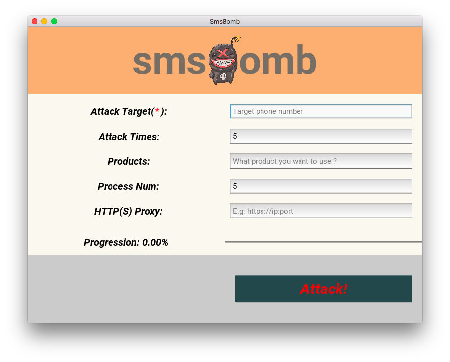

# smsBomb
超级简单易用的短信💣轰炸🐔

# 使用说明

本程序使用 Python3.6.4 在 Mac 上开发，不兼容 Python2.x。如果多版本Python, 您可以尝试 PyEnv 或者 Anaconda

#### CLI 版本

```
usage: python -m smsBomb [-h] -t TARGET [-n TIMES]
                         [-p {aliyun,cl253,juhe,luosimao,miaodi,netease,normal,smsbao,tencent,ucp,yunpian}]
                         [-c CONFIG] [--process PROCESS_NUM] [-m MESSAGE] [-v]
                         [-x PROXY]
python -m smsBomb: error: the following arguments are required: -t/--target


短信轰炸机

optional arguments:
  -h, --help            show this help message and exit
  -t TARGET, --target TARGET
                        指定攻击目标手机号
  -n TIMES, --times TIMES
                        指定攻击次数,默认10
  -p {aliyun,cl253,juhe,luosimao,miaodi,netease,normal,smsbao,tencent,ucp,yunpian}, --product {aliyun,cl253,juhe,luosimao,miaodi,netease,normal,smsbao,tencent,ucp,yunpian}
                        使用指定产品攻击,比如网易netease/云之讯/创蓝253/腾讯云/阿里云
  -c CONFIG, --config CONFIG
                        指定配置文件
  --process PROCESS_NUM
                        进程数,默认5
  -m MESSAGE, --message MESSAGE
                        自定义的消息体,如果支持的话
  -v, -verbose          日志级别,-v,-vv,-vvv
  -x PROXY, --proxy PROXY
                        设置发起请求时的代理http/https,如果没设置将自动尝试环境变量 HTTP_PROXY 和
                        HTTPS_PROXY

See https://von.sh/smsBomb

```

#### GUI 版本

您可以执行 `python -m smsBomb.gui` 执行，效果图如下:



> Kivy 程序并没有经过严格的测试,慎用!


# 原理

利用 Github 提供的 [Searching-Code](https://help.github.com/articles/searching-code/) 搜索一些安全意识薄弱的用户不小心泄漏出来的敏感信息。

以 PHP 项目为例子:
我需要在 application 目录下查找所有文件名含有 config, 内容中含有 `sms/send` 字样的配置文件 `(in file)` 不搜索 `fork` 的仓库

那么一个完整的搜索语法即为:

> in:file fork:false language:php path:application filename:config  sms/send

这些搜索结果里面会包含一些如阿里云/腾讯云/创蓝等云服务商的 `app_key` 或者 `app_secret` 等

本项目即使利用这些敏感信息，再根据官方文档利用 [requests](https://github.com/requests/requests/) 编写一些简单的签名算法完整请求即可。

目前，项目中实现了以下服务商提供的短信发送服务:


#### 目前支持的短信渠道


+ [螺丝帽:luosimao](https://luosimao.com/)
+ ~~[赛邮:submail](https://www.mysubmail.com)~~
+ [网易:netease](http://dev.netease.im/docs/product/%E7%9F%AD%E4%BF%A1/%E7%9F%AD%E4%BF%A1%E6%8E%A5%E5%8F%A3%E6%8C%87%E5%8D%97)
+ [创蓝253:cl253](https://zz.253.com/v5.html)
+ [云之讯:ucp](http://www.ucpaas.com/)
+ [短信宝:smsbao](http://api.smsbao.com/)
+ [云片:yunpian](https://www.yunpian.com/)
+ [腾讯:tencent](https://cloud.tencent.com/document/product/382/5808)
+ [秒滴云:miaodi](http://www.miaodiyun.com/)
+ [聚合数据:juhe](https://www.juhe.cn/)
+ [阿里大鱼:aliyun](https://dayu.aliyun.com/)

当然还有一些小众的可以直接使用通用类进行发送 即指定 `-p normal`

# 配置说明

默认配置: `config/sms.json`

配置内容是一个数组, 其中每一个元素代表一个可用于攻击的产品配置, 其中字段说明参见下表:

#### 字段说明

| 字段    | 类型  | 含义  | 是否必须  | 其他说明  |
|-------  |----|---|---|---|
| product | string | 产品名,自己取  | 是   |   |
| desc    | string | 产品描述,用于人看  | 否  |   |
| source  | string | 表示配置来源  | 否  |   |
| auth    | object | 授权信息, k-v 形式,具体对 key 依赖于产品  | 否  |   |
| payloads| object | 需要提交的请求参数 | 否 | 此配置依赖于产品 |
| api     | string | 请求地址     | 否 | 如果写了此API地址则请求发起至此API，否则发起之对应产品的默认配置 API, 参见 API_URLS |
| method  | string | 请求方式     | 否 | 默认为GET请求,此配置依赖于各产品如何实现 `send` 方法的 |
| enable_custom_msg| bool | 是否支持自定义消息体| 否| 默认是不支持,如果设置true,参数 `-m` 中的消息将作为短信内容进行发送|
| weight  | int    | 权重        | 否 | 默认值1,最小1,当 `weight` 为0则标志为节点不可以用,此数字越大代表被选中的概率越大|


# 发散思维

敏感信息不仅仅有短信，您也可以搜索其他敏感的信息，比如数据库地址/账户信息

以国内较多 ThinkPHP 网站为例子:

> path:application language:PHP hostname 服务器地址 NOT 127.0.0.1

其中我们可以发现许多数据库直接公之于众的，当然其中也不乏如身份证信息&账户支付信息的重要信息.


# 其他说明

利用 Github 的搜索接口目前仅能搜索到 `master` 分支(设置的主分支), 如果需要搜索到其他分支以及其提交记录,
可以尝试使用 [truffleHog](https://github.com/dxa4481/truffleHog) 等工具

比如结合 PyGithub 调用 Github 的搜索接口，将搜索到的重要的一些 repo 再利用 truffleHog 尝试深挖。


# 程序结构:

```

├── LICENSE
├── README.md
├── config
│   └── sms.json            <--- 配置文件, 参见上方原理以及配置说明
├── requirements-gui.txt    <--- GUI 版本依赖
├── requirements.txt        <--- CLI 版本依赖
├── screenshot              <--- 截屏文件,用于readme
│   └── bomb-gui.png
└── smsBomb
    ├── __init__.py
    ├── __main__.py
    ├── cli.py              <--- CLI 版本主程序,请执行python -m smsBomb
    ├── data                <-- GUI程序使用的图片及其字体
    │   ├── bomb.png
    │   └── fzht.ttf
    ├── gui.py              <--- 截GUI 版本主程序,请执行 python -m smsBobm.gui 运行
    ├── plugins             <-- 插件目录,每一个文件可支持一种产品的攻击形式
    │   ├── aliyun.py
    │   ├── cl253.py
    │   ├── juhe.py
    │   ├── luosimao.py
    │   ├── miaodi.py
    │   ├── netease.py
    │   ├── normal.py
    │   ├── smsbao.py
    │   ├── tencent.py
    │   ├── ucp.py
    │   └── yunpian.py
    ├── smsBomb.py          <-- 程序逻辑
    └── smsbomb.kv          <-- GUI描述文件

```


# 本项目仅供学习研究，请勿用于非法用途!!!!!!!!!!!


# ChangeLog

#### 2018-05-12

+ 调整修改日志级别
+ 调整程序目录结构(修改为 -m 模块化执行, cli/gui 更突出功能与作用)
+ 调整文档

#### 2018-05-09

+ 更新文档
+ GUI 版本增加自定义消息功能(增加字体库以支持中文)
+ 修复时间格式错误以及编码错误 [#2](https://github.com/shellvon/smsBomb/pull/2) By [@williamzhanggg](https://github.com/williamzhanggg)

#### 2018-05-07

+ 增加 [Kivy](https://github.com/kivy/kivy) 编写 GUI 程序
+ 优化调整 `smsBomb.start` 支持进度回调
+ 修复 log 在 Kivy 框架下不展示的 BUG, 参见 [kivy/kivy#4113](https://github.com/kivy/kivy/issues/4113)

#### 2018-05-03

+ 支持设置 `http/https` 代理,使用参数 `-x, --proxy` 指定
+ 更新发起时请求头
+ ~~移除 submail 的支持~~
+ 将原来的 **随机算法** 修改为 **加权随机负载均衡** 算法， 配置文件增加 `weight` 参数用于此操作。
+ 支持简单的故障节点剔除(当没有可用的节点时会认为所有节点都可用,但并不会专门的做探活)
+ 增加攻击进度( `-v/--verbose` 可看)

#### 2018-05-02

+ 增加 colored log 日志配置
+ 增加 `-v/--verbose` 参数命令用于调试
+ 增加 `get_msg_content` 方法用于智能获取发送的短信内容(依据不同产品决定是否可以使用 `-m` 参数作为短信内容)

#### 2018-04-28

+ 单一文件改为插件化形式，动态支持加载 plugins 目录下的其他短信产品.
+ 初版发布


# 已知 BUGs.

+ 使用 PyInstaller 打完包之后提示 `Unable to find any valuable Window provider`.
+ `Ctrl + C` 在 multiptoceessing 下还未处理
